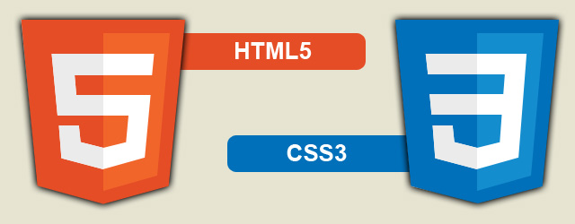
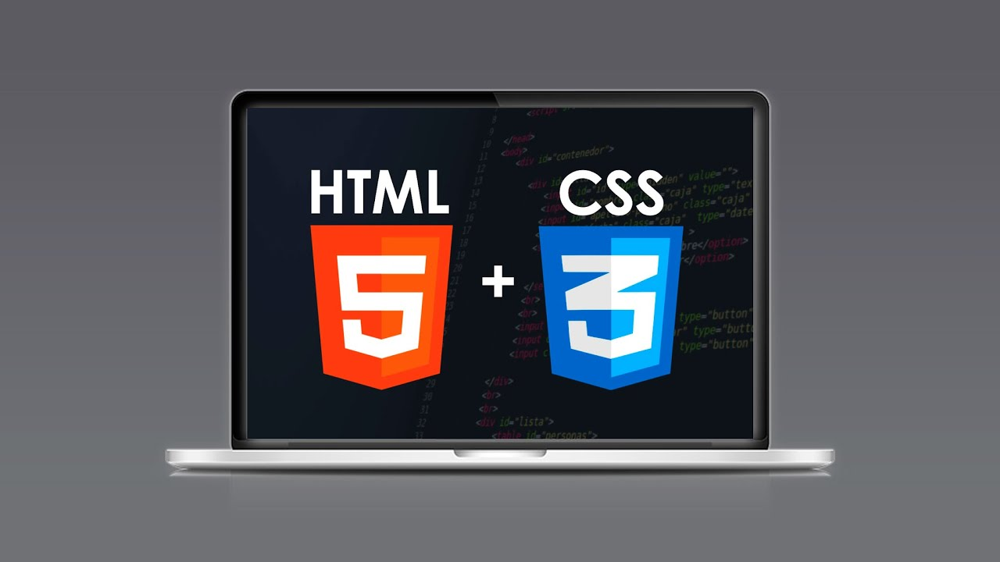

<!--  -->

# Curso: Desarrollo Web con HTML || código 85301

> Curso: Desarrollo Web con HTML |  
> Lunes y Miércoles de 10hs a 12hs (Arg) |  
> 9 clases desde 10/08/2026 hasta 09/09/2026 |  
> Código: 85301 |  
> sensei: Marcos Pinardi |  

## 🚀 Objetivo
> Aprender a crear páginas web y sitios web y con ello tener mejores herramientas para mejorar nuestra situación laboral

## 📚 Definición: 
> Es un lenguaje de programación para crear páginas web.  
> Es un lenguaje de marcado (porque cada instrucción es una marca).  
> A las instrucciones les llamamos elementos o etiquetas.  

## 🛠️ Requisitos de software

  1. Un Browser   
  2. Un editor de Código  

### 🛠️ Editores de código

Webstorm: <https://www.jetbrains.com/webstorm/>  
Visual Studio Code: <https://code.visualstudio.com/>    
Playcode: <https://playcode.io/>   
Codeanywhere: <https://codeanywhere.com/>   

## 💻 Sintáxis

> La sintáxis de HTML corresponde a un sistema de contenedores	

	<elemento>
		objeto
	</elemento>

	<elemento>
		<elemento>
			objeto
		</elemento>
	</elemento>

> Nota: en HTML todos son contenedores, EXCEPTO las interrupciones.  

## 💻 Fórmula de HTML

    <elemento atributo="valor">
      	objeto
	</elemento>

## 💻 Fórmula de CSS

    selector{
		atributo:valor;
	}

----

> Alumni: https://alumni.education/

----
## ☕ Apoyá al profe   

  

